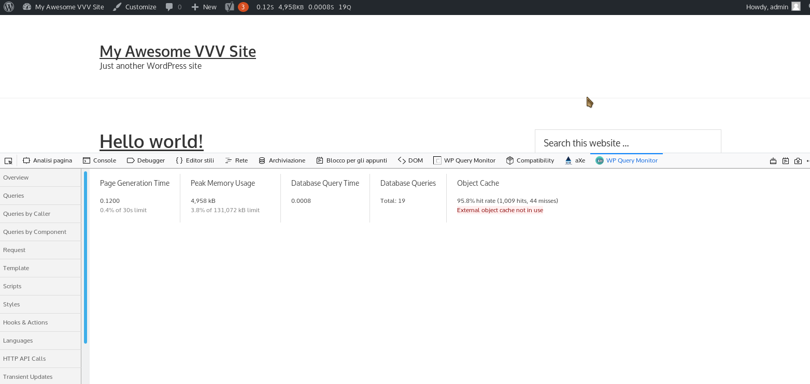

# WP Query Monitor

[QueryMonitor](https://wordpress.org/plugins/query-monitor/) is a cool plugin for WordPress developers but can be more comfortable on the developer tools of the browsers!  
This extension take the output of the plugin in the page inside the DevTools to let you to move in a second window!  
Also implement new features like the saving of filters!

 
